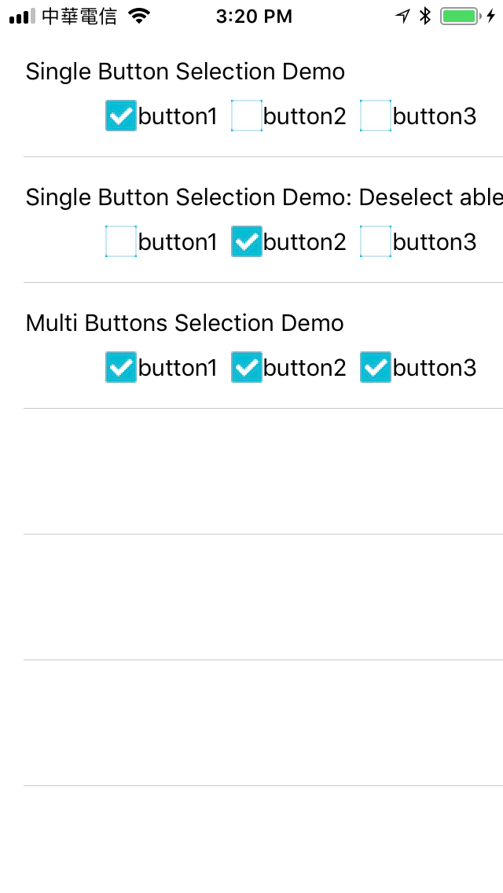

# IRSingleButtonGroup-swift

- IRSingleButtonGroup-swift is a powerful buttons group framework for iOS.
- See objc version in here: [IRSingleButtonGroup](https://github.com/irons163/IRSingleButtonGroup).

## Features

- Single Button Selection.
- Single Button Selection Demo: Deselect able.
- Multi Buttons Selection.

## Install
### Cocoapods
- Add `pod 'IRSingleButtonGroup-swift'`  in the `Podfile`
- `pod install`

## Usage

- more examples in the demo applications.

### Basic

```swift

self.singleButtonGroup = IRSingleButtonGroup.init()
self.singleButtonGroup.buttons = [self.button1, self.button2, self.button3]
self.singleButtonGroup.delegate = self

// MARK: - SingleButtonGroupDelegate
func didSelectedButton(button: UIButton) {
    NSLog("Button%ld", button.tag)
}

func didDeselectedButton(button: UIButton) {
    NSLog("Button%ld", button.tag)
}
```

### Advanced settings
```swift
singleButtonGroup.canMultiSelected = false
singleButtonGroup.canSelectWhenSelected = true
singleButtonGroup.setInitSelected(selectedButton: button)
```

## Screenshots

